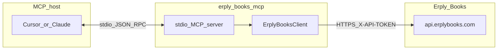

# Erply Books MCP Server

Open-source [Model Context Protocol](https://modelcontextprotocol.io) server for the
[Erply Books accounting API](https://www.erplybooks.com/api/).

It exposes organisation, master data, invoices, payments, ledger/transactions, reports,
and create/update/delete mutations as **`erply_`-prefixed MCP tools** over **stdio**,
so AI assistants (Cursor, Claude Desktop, etc.) can work with an Erply Books company
without the hosted SaaS product.

> **Status: read + write MVP.** Auth, HTTP client, read tools, and core mutations ship
> in this package. Track product work in the GitLab milestone *Erply Books*
> (`werkstatt.ee/e-financials-mcp`); this GitHub repo is the OSS code host.

## Prerequisites

- **Node.js 20+** (see `package.json` `engines`; native `fetch`; Vitest 4 / CI use Node 20 and 22).
- An **Erply Books** organisation and **API token**.

### API token

Create or manage tokens in the Erply Books UI (settings / API access — see
[Erply Books API docs](https://www.erplybooks.com/api/)). Tokens often require an
**IP allowlist**: the machine that runs this MCP server must be listed, or requests
will fail (typically HTTP 401/403).

## Quick start

```bash
git clone https://github.com/werkstatt-jasper/erply-books-mcp.git
cd erply-books-mcp
cp .env.example .env   # set ERPLY_BOOKS_API_TOKEN
npm install
npm run build
npm start              # MCP server on stdio
```

## Environment variables

Copy `.env.example` to `.env` and fill in values. The server loads `.env` via
`dotenv/config` at startup. **Never commit `.env`** (it is gitignored).

| Variable | Required | Description |
|----------|----------|-------------|
| `ERPLY_BOOKS_API_TOKEN` | Yes | API token sent as `X-API-TOKEN`. |
| `ERPLY_BOOKS_API_BASE_URL` | No | Base URL without trailing slash. Default: `https://api.erplybooks.com/api`. |
| `ERPLY_BOOKS_HTTP_MAX_RETRIES` | No | Extra attempts for transient failures (network, 408, 429, 5xx). Default: `0` (off). |
| `ERPLY_BOOKS_HTTP_RETRY_BASE_MS` | No | Base delay in ms for exponential backoff. Default: `500`. |
| `ERPLY_BOOKS_REQUEST_TIMEOUT_MS` | No | Per-request timeout in ms. Default: `30000`. |
| `LOG_LEVEL` | No | Pino level on **stderr**: `fatal`, `error`, `warn`, `info`, `debug`, `trace`, `silent`. Default: `info`. |

Structured logs go to **stderr** only. **stdout** is reserved for MCP JSON-RPC.

## MCP host configuration

Point your MCP client at the built server (`dist/index.js`).

**Cursor** (`~/.cursor/mcp.json` or project `.cursor/mcp.json`):

```json
{
  "mcpServers": {
    "erply-books": {
      "command": "node",
      "args": ["/absolute/path/to/erply-books-mcp/dist/index.js"],
      "env": {
        "ERPLY_BOOKS_API_TOKEN": "your_api_token"
      }
    }
  }
}
```

**Claude Desktop** — same `mcpServers` shape in the app config
(`claude_desktop_config.json` on your OS), with an absolute path to `dist/index.js`.

If `.env` is populated and the working directory is the project root, `npm start`
picks up credentials without duplicating them in the MCP client `env` block.

## Architecture



## Authentication

Unlike RIK e-Financials (HMAC), Erply Books uses a **bearer-style header**:

1. **`X-API-TOKEN`** — value of `ERPLY_BOOKS_API_TOKEN`.
2. **`Content-Type: application/json`** for request bodies.
3. **`User-Agent`** — package-identifying UA from this server.

### IP allowlist

If the API rejects calls after a valid-looking token:

1. Confirm the token is active in Erply Books.
2. Add the **egress IP** of the host running the MCP server to the token allowlist.
3. Retry; persistent 401/403 with an allowlisted IP usually means a wrong or revoked token.

## Tools

All tool results are JSON in MCP text content blocks. List tools return
`{ totalCount, items }` (organisation blob stripped). Mutations return the API body;
HTTP 204 becomes `{ ok: true }`. Creates send **`id: 0`** as required by Erply Books.

Some endpoints return **HTTP 409** with an HTML body naming a **`MODULE_*`** code when
the org price plan lacks that feature. Tools still ship; clients should surface the
structured `ErplyBooksApiError`.

### Organisation

| Tool | API | Required |
|------|-----|----------|
| `erply_get_organisation` | `GET /organisation` | — |

### Accounts

| Tool | API | Required |
|------|-----|----------|
| `erply_list_accounts` | `GET /accounts` | — |
| `erply_create_account` | `POST /accounts` | `number`, `name` |
| `erply_update_account` | `PUT /accounts/{accountId}` | `accountId` |
| `erply_delete_account` | `DELETE /accounts/{accountId}` | `accountId` |

### Tax rates

| Tool | API | Required |
|------|-----|----------|
| `erply_list_tax_rates` | `GET /tax_rates` | — |
| `erply_create_tax_rate` | `POST /tax_rates` | `name`, `percent` |
| `erply_update_tax_rate` | `PUT /tax_rates/{taxRateId}` | `taxRateId` |
| `erply_delete_tax_rate` | `DELETE /tax_rates/{taxRateId}` | `taxRateId` |

### Customers

| Tool | API | Required |
|------|-----|----------|
| `erply_list_customers` | `GET /customers` | — |
| `erply_create_customer` | `POST /customers` | `name` |
| `erply_update_customer` | `PUT /customers/{customerId}` | `customerId` |
| `erply_delete_customer` | `DELETE /customers/{customerId}` | `customerId` |

Note: `GET /customers/v2` returns **405** on current tokens — list uses `/customers`.

### Invoices / documents

| Tool | API | Required |
|------|-----|----------|
| `erply_list_invoices` | `GET /invoices` | `dateFrom`, `dateTo`, `documentType` |
| `erply_get_invoice` | `GET /invoices/{documentId}` | `documentId` |
| `erply_create_invoice` | `POST /invoices` | `typeCode`, `date`, and `customerId` or `customer` |
| `erply_update_invoice` | `PUT /invoices/{documentId}` | `documentId` |
| `erply_delete_invoice` | `DELETE /invoices/{invoiceId}` | `invoiceId` |
| `erply_get_invoice_pdf` | `GET /invoices/pdf/v2/{documentId}` | `documentId` |
| `erply_send_invoice_email` | `POST /invoices/email/simple` | `documentId`, `receiver` |
| `erply_get_einvoice` | `GET /invoices/einvoice` | `documentIds` |
| `erply_send_einvoices` | `POST /invoices/send_einvoices` | `documentIds` |
| `erply_confirm_invoices` | `POST /invoices/confirm_invoices` | `ids` |
| `erply_list_partner_invoices` | `GET /invoices/partner` | `dateFrom`, `dateTo` |
| `erply_create_partner_invoice` | `POST /invoices/partner` | `typeCode`, `date`, and `customerId` or `customer` |
| `erply_create_recurring_invoice` | `POST /invoices/recurring` | `copyFromDocumentId` |
| `erply_update_recurring_invoice` | `PUT /invoices/recurring/{documentId}` | `documentId` |

`documentType` / `typeCode` use [API Dictionary](https://www.erplybooks.com/api-dictionary/)
codes (e.g. `DOCUMENT_SELL`, `DOCUMENT_POS_SELL`). Optional query `registrationCode` on
create/update/delete. PDF uses **v2 JSON** (not binary `/invoices/pdf/{id}`). `documentIds` / `ids`
accept a comma-separated string or a number array.

#### Invoice workflow

| Tool | API | Required |
|------|-----|----------|
| `erply_add_invoice_attribute` | `POST /invoices/add_attribute` | `documentId` |
| `erply_add_invoice_dimension` | `POST /invoices/add_dimension` | — |
| `erply_add_invoice_document_connection` | `POST /invoices/add_document_connection` | `documentId`, `baseDocumentId` |
| `erply_add_invoice_opposite` | `POST /invoices/add_opposite` | — |
| `erply_add_invoice_to_queue` | `POST /invoices/add_to_queue` | — |
| `erply_delete_invoice_via_post` | `POST /invoices/delete` | `id` |
| `erply_delete_invoices_multiple_and_payments` | `POST /invoices/delete_multiple_and_payments` | — |
| `erply_forward_invoice_to_user` | `POST /invoices/forward_to_user` | `userId` |
| `erply_override_invoice_fields` | `POST /invoices/override` | `documentIds`, `fieldName` |
| `erply_prepare_invoice_rows` | `POST /invoices/prepare_rows` | `baseDocumentId` |
| `erply_split_invoice_rows` | `POST /invoices/split_rows` | — |
| `erply_update_invoice_split_rows` | `PUT /invoices/split_rows/{documentId}` | `documentId` |
| `erply_use_invoice_prepayment` | `POST /invoices/use_prepayment` | `documentId` |
| `erply_delete_partner_invoice` | `DELETE /invoices/partner` | `invoiceId` |
| `erply_update_partner_invoice` | `PUT /invoices/partner/{documentId}` | `documentId` |
| `erply_delete_invoice_row` | `DELETE /invoices/{documentId}/rows/{articleRowId}` | `documentId`, `articleRowId` |

Opposite/split/partner-update bodies accept extra spec fields via passthrough. `erply_delete_invoice_via_post` is the POST alias of `erply_delete_invoice`. Destructive tools require an explicit id.

### Payments

| Tool | API | Required |
|------|-----|----------|
| `erply_list_payments` | `GET /payments` | `dateFrom`, `dateTo` |
| `erply_create_payment` | `POST /payments` | `opDate`, `sumPaid` |
| `erply_update_payment` | `PUT /payments/{paymentId}` | `paymentId` |
| `erply_delete_payment` | `DELETE /payments/{paymentId}` | `paymentId` |
| `erply_import_payment` | `POST /payments/import` | `date`, `amount`, `typeCode` |
| `erply_save_all_payment_imports` | `POST /payments/save_all_payments` | `items` |
| `erply_connect_payment_with_documents` | `POST /payments/connect_payment_with_documents` | payment id + document id |
| `erply_list_pending_payments` | `GET /payments/pending_payments` | — |
| `erply_settle_prepayments` | `POST /payments/settle_prepayments` | `paymentId`, `paymentId2`, or `ids` |
| `erply_sepa_payments` | `POST /payments/sepa_payments/json_format` | — |
| `erply_bank_import` | `POST /payments/bank_import` | `fileBase64`, `fileName` |
| `erply_bank_import_v2` | `POST /payments/bank_import/v2` | `fileBase64`+`fileName` or `attachmentId` |

`erply_bank_import` uses multipart. `erply_bank_import_v2` posts JSON `APIBankImportInfo` (nested `apiAttachmentInfo`); tool args `getEverything` / `getMissing` / `separatorField` map to API `everything` / `missing` / `separator`.

#### Bank-import reconciliation workflow (verified on Demo testbaas)

The accountant workflow after importing a bank statement is:

1. **Import** with `erply_bank_import` / `erply_bank_import_v2` or create rows with `erply_import_payment`.
2. **List unmatched** with `erply_list_pending_payments`.
3. **Link to invoice/order** by updating the created payment:
   - `erply_update_payment` with `paymentId`, `invoiceId`, `opDate`, `sumPaid`, `typeCode`, `accountId`, `customerId`, `currencyCode`.
   - This sets `sumPaid` on the invoice and reduces `sumLeftToPay`.
4. **Verify** with `erply_get_invoice`.

`erply_connect_payment_with_documents` is intended for step 3, but on Demo testbaas it consistently returns **409** `DataConflictException` with `messageCode`: `The list of documents is empty` for every combination of pending import id, payment id, invoice id, sales order id, and document number we tested. Use the `erply_update_payment` workaround below until Erply clarifies the expected payload.

##### Working example: link an imported payment to an invoice

```json
// erply_update_payment
{
  "paymentId": 120662763,
  "opDate": "2026-08-11",
  "sumPaid": 100,
  "invoiceId": 83896219,
  "typeCode": "OTHER_INCOMING_PAYMENT",
  "accountId": 1307870,
  "customerId": 15709235,
  "currencyCode": "CURRENCY_EUR"
}
```

After this, `GET /invoices/83896219` returns `sumPaid: 100`, `sumLeftToPay: 0`.

##### `erply_save_all_payment_imports` behavior

Saving an import row with `invoiceId` via `erply_save_all_payment_imports` updates the import row only; it does **not** create a linked payment or change the invoice totals.

### Attachments

The Erply Books Purchase Inbox is the attachments surface: there is no dedicated
`/inbox` path. Unprocessed supplier files are attachments **without** a `documentId`.

#### CRUD

| Tool | API | Required |
|------|-----|----------|
| `erply_list_attachments` | `GET /attachments/all` | — |
| `erply_get_attachment` | `GET /attachments/all/{attachmentId}` | `attachmentId` |
| `erply_create_attachment` | `POST /attachments` | `fileBase64`, `fileName` |
| `erply_delete_attachment` | `DELETE /attachments/{attachmentId}` | `attachmentId` |

`erply_get_attachment` (and `erply_get_attachment_child`) return JSON when the API
responds with JSON. File downloads that are not JSON come back as UTF-8 text or
`{ encoding: "base64", byteLength, data }`.

Create maps `fileName`/`fileBase64` to API fields `filename`/`base64`. Three POST modes:

1. **Attach to an existing invoice** — pass `documentId`, keep `total` null.
2. **Add to the Purchase Inbox** — omit `documentId`, keep `total` null.
3. **Create an expense document instantly** — set `total` (and optional `netTotal`, `taxRateId`, `contactName`, `expenseType`).

List accepts inbox-style filters: `getNotConnectedInvoices`,
`getOnlyPartnerSupplierDocuments`, `getOnlyLocalSupplierDocuments`,
`getOnlyNotSupplierConnectedDocuments`, `doNotGetInvoice`, `getLast10`,
`getProjectsFromDocuments`, `reportGeneratorInput`.

#### Purchase inbox

Typical loop: list unprocessed items → digitize → parse → confirm or convert.

| Tool | API | Required |
|------|-----|----------|
| `erply_digitize_attachment` | `PUT /attachments/digitize/{itemId}` | `itemId` |
| `erply_parse_attachment` | `GET /attachments/parse/{attachmentId}` | `attachmentId` |
| `erply_confirm_attachment` | `POST /attachments/confirm` | — |
| `erply_mark_attachment_opened` | `PUT /attachments/mark_attachment_as_opened/{itemId}` | `itemId` |
| `erply_mark_attachment_not_digitizable` | `PUT /attachments/not_digitizable/{itemId}` | `itemId` |
| `erply_create_purchase_order_from_attachment` | `POST /attachments/add_purchase_order` | — |
| `erply_link_attachment_to_erply_invoice` | `POST /attachments/erply_invoice_only` or `PUT …/{documentId}` | — |

`erply_confirm_attachment` sends JSON `APIDocumentConfirmationInfo`
(`attachmentId`, `waitingForUserId`, `additionalMessage`, `customEmail`, `sendEmail`, …).
The live API returns HTTP 415 for multipart on this path. `erply_link_attachment_to_erply_invoice`
uses PUT when `documentId` is set.

#### File helpers

| Tool | API | Required |
|------|-----|----------|
| `erply_get_attachment_preview` | `GET /attachments/preview` | — |
| `erply_get_attachment_html_template` | `GET /attachments/html_template` | — |
| `erply_get_attachments_zip` | `GET /attachments/zip_file/{documentId}` | `documentId` |
| `erply_get_summary_invoice` | `GET /attachments/summary_invoice/{attachmentId}` | `attachmentId` |
| `erply_get_attachment_child` | `GET /attachments/{attachmentId}/child` | `attachmentId` |
| `erply_create_attachments_multiple` | `POST /attachments/multiple` | `files` |
| `erply_create_attachment_simple` | `POST /attachments/simple` | `fileBase64`, `fileName` |
| `erply_delete_attachment_via_post` | `POST /attachments/delete` | `id` |
| `erply_delete_activity_attachment` | `DELETE /attachments/all/{activityItemAttachmentId}` | `activityItemAttachmentId` |

Preview returns `{ contentType: "text/html", body }`. The client sends `Accept: text/html`
for this call; `Accept: application/json` yields HTTP 406.

#### Digi queue

| Tool | API | Required |
|------|-----|----------|
| `erply_get_digi_attachment` | `GET /attachments/digi/{attachmentId}` | `attachmentId` |
| `erply_create_digi_base64` | `POST /attachments/digi/base64` | `fileBase64`, `fileName` |
| `erply_create_digi_form` | `POST /attachments/digi/form` | `fileBase64`, `fileName` |
| `erply_get_digi_country_from_parser` | `POST /attachments/digi/country_from_parser` | — |

#### KYC

| Tool | API | Required |
|------|-----|----------|
| `erply_submit_kyc` | `POST /attachments/kyc` | `fileBase64`, `fileName` |
| `erply_submit_kyc_json` | `POST /attachments/kyc/json` | `fileBase64`, `fileName` |

### Articles and projects

| Tool | API | Required |
|------|-----|----------|
| `erply_list_articles` | `GET /articles` | — |
| `erply_create_article` | `POST /articles` | `name` |
| `erply_update_article` | `PUT /articles/{articleId}` | `articleId` |
| `erply_delete_article` | `DELETE /articles/{articleId}` | `articleId` |
| `erply_list_projects` | `GET /projects` | — |
| `erply_create_project` | `POST /projects` | `name` |
| `erply_update_project` | `PUT /projects/{projectId}` | `projectId` |
| `erply_delete_project` | `DELETE /projects/{projectId}` | `projectId` |

Project create/update use body field `affirmed` (list filter remains `isAffirmed`). `/projects/groups` is not shipped yet.

### Ledger and transactions

| Tool | API | Required |
|------|-----|----------|
| `erply_list_account_entries` | `GET /account_entries` | `dateFrom`, `dateTo` |
| `erply_list_transaction_entries` | `GET /transaction_entries` | `dateFrom`, `dateTo` |
| `erply_get_transaction_entry` | `GET /transaction_entries/{id}` | `transactionEntryId` |
| `erply_create_transaction_entry` | `POST /transaction_entries` | `opDate`, `typeCode`, `accountEntries` |
| `erply_update_transaction_entry` | `PUT /transaction_entries/{transactionEntryId}` | `transactionEntryId` |
| `erply_delete_transaction_entry` | `DELETE /transaction_entries/{transactionEntryId}` | `transactionEntryId` |

Journal creates typically use `typeCode` `DIRECT_TRANSACTION` and balanced `accountEntries` rows (`accountId` plus `debitSum` / `creditSum`). Plans without **MODULE_TRANSACTIONS** return HTTP 409.

### Reports

| Tool | API | Required |
|------|-----|----------|
| `erply_balance_sheet` | `GET /reports/balance_sheet` | `dateFrom`, `dateTo` |
| `erply_income_sheet` | `GET /reports/income_sheet` | `dateFrom`, `dateTo` |
| `erply_aged_receivables` | `GET /reports/aged` | `dateFrom`, `dateTo` |
| `erply_general_ledger` | `GET /reports/general_ledger` | `dateFrom`, `dateTo` |
| `erply_daybook` | `GET /reports/daybook` | `dateFrom`, `dateTo` |
| `erply_trial_balance` | `GET /reports/trial_balance` | `dateFrom`, `dateTo` |
| `erply_vat_ee` | `GET /reports/tax/ee/vat` | `dateFrom`, `dateTo` |
| `erply_contact_balance` | `GET /reports/contact_balance` | `dateFrom`, `dateTo` |
| `erply_fixed_assets` | `GET /reports/fixed_assets` | `dateFrom`, `dateTo` |

### Custom reports (report generator)

Erply Books custom reports use `POST /report_generator` with a JSON query (tables, parameters, output). Discover columns first via `erply_list_custom_report_columns`. File endpoints may return CSV/XML as UTF-8 or XLSX as base64 (`encoding: "base64"`). Production/planner/AI generator routes are not included (E35).

| Tool | API | Required |
|------|-----|----------|
| `erply_run_custom_report` | `POST /report_generator` | — |
| `erply_run_custom_report_csv` | `POST /report_generator/csv` | — |
| `erply_run_custom_report_xlsx` | `POST /report_generator/xlsx` | — |
| `erply_run_custom_report_excel` | `POST /report_generator/custom_excel` | — |
| `erply_send_custom_report_email` | `POST /report_generator/email` | — |
| `erply_send_custom_report` | `POST /report_generator/send_report` | — |
| `erply_run_custom_reports_multiple` | `POST /report_generator/multiple` | `items` |
| `erply_run_custom_report_file` | `POST /report_generator/file` | — |
| `erply_run_custom_report_file_json` | `POST /report_generator/file/{type}/json_format` | `type` |
| `erply_list_custom_report_columns` | `GET /report_generator/columns` | — |
| `erply_contact_invoice_result_report` | `GET /report_generator/contact_invoice_result_report` | — |
| `erply_list_user_defined_reports` | `GET /report_generator/user_defined` | — |
| `erply_get_custom_report_xml` | `GET /report_generator/xml` | — |
| `erply_get_custom_report_file` | `GET /report_generator/file/{type}` | `type` |
| `erply_edit_custom_report_callback` | `POST /report_generator/edit` | — |
| `erply_update_custom_report_values` | `POST /report_generator/update_values` | — |

### Settings / dictionaries

| Tool | API | Required |
|------|-----|----------|
| `erply_get_dictionary` | `GET /settings/dictionaries/{dictionaryCode}` | `dictionaryCode` |

`dictionaryCode` is one of: `ACCOUNT_TYPE`, `TRANSACTION_TYPE`, `INCOME_TYPE`,
`BALANCE_TYPE`, `ACCOUNT_FEATURE_TYPE`, `DOCUMENT_TYPE`, `ENTITY_TYPE`, `ARTICLE_TYPE`,
`UNIT`, `PAYMENT_TYPE`, `ARTICLE_ROW_TYPE`, `CURRENCY`, `CASH_FLOW_TYPE`,
`ARTICLE_FEATURE_TYPE`, `TAX_RATE_TYPE`, `DOCUMENT_STATUS_TYPE`, `LANGUAGE`. Optional
`languageCode` (e.g. `LANGUAGE_ET`) localizes names. See the
[API Dictionary](https://www.erplybooks.com/api-dictionary/) for value lists.

**Coverage vs the full Erply Books API:** see [docs/api-coverage.md](docs/api-coverage.md)
for the full endpoint matrix (356 spec operations: covered / gap-issue / skipped)
and [docs/spec-conformance.md](docs/spec-conformance.md) for the verification of
implemented tools against the OpenAPI spec and prose docs. Uncovered endpoints are
tracked as GitLab issues E29–E46 in the
[Erply Books milestone](https://gitlab.com/werkstatt.ee/e-financials-mcp/-/milestone/12);
GoERP `*/get_single` aliases are intentionally skipped.

## Upstream API documentation

| Resource | URL |
|----------|-----|
| API overview | https://www.erplybooks.com/api/ |
| Swagger UI | https://www.erplybooks.com/api-documentation |
| OpenAPI JSON | https://www.erplybooks.com/wp-content/uploads/2026/06/openapi.json |
| API Dictionary | https://www.erplybooks.com/api-dictionary/ |

## Testing

| Command | What it does |
|---------|--------------|
| `npm test` | Unit tests (Vitest; excludes `*.integration.test.ts`) |
| `npm run test:coverage` | Unit tests with **100%** coverage thresholds on `src/` |
| `npm run test:integration` | Live API tests (requires `.env` token; **not** run in CI) |
| `npm run lint` | Biome check |
| `npm run build` | Compile TypeScript to `dist/` |
| `npm audit --audit-level=high` | Dependency audit (also run in CI) |

### Integration tests

Gated on `ERPLY_BOOKS_API_TOKEN` via `describe.skipIf`:

- [`src/client.integration.test.ts`](src/client.integration.test.ts) — live GETs
- [`src/tools/tools.integration.test.ts`](src/tools/tools.integration.test.ts) — tool handlers

Config: [`vitest.integration.config.ts`](vitest.integration.config.ts) (45s timeout).

On restricted sandbox plans, many endpoints return **409** (`MODULE_*`) or reports
return **500**. Live tests accept success **or** a structured `ErplyBooksApiError`
with those statuses so CI-like local runs stay green without a full price plan.

## Troubleshooting

| Symptom | Likely cause |
|---------|----------------|
| Startup error about missing token | Set `ERPLY_BOOKS_API_TOKEN` in `.env` or MCP `env` |
| 401 / 403 from API | Wrong/revoked token, or **IP not allowlisted** |
| 409 with HTML mentioning `MODULE_*` | Org price plan lacks that module (not a client bug) |
| Report tools return 500 | Seen on some sandbox orgs; retry later or use another org |
| MCP client “broken JSON” / parse errors | Do not log to **stdout**; use `LOG_LEVEL` / stderr only |
| Empty invoice list | Must pass a valid `documentType` (e.g. `DOCUMENT_POS_SELL`) |

## Package consumption

This package is published as **`@werkstatt/erply-books-mcp`** with subpath exports
(`./client`, `./auth`, `./server-setup`, `./tools/*`, etc.) for embedding as a
git submodule / npm workspace (hosted SaaS wiring is a separate milestone).

## Contributing

See [CONTRIBUTING.md](CONTRIBUTING.md).

## License

[MIT](LICENSE)
