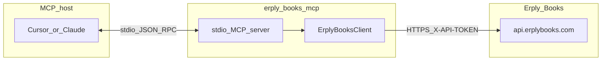

# Erply Books MCP Server

Open-source [Model Context Protocol](https://modelcontextprotocol.io) server for the
[Erply Books accounting API](https://www.erplybooks.com/api/).

It exposes organisation, master data, invoices, payments, ledger/transactions, reports,
and create/update/delete mutations as **`erply_`-prefixed MCP tools** over **stdio**,
so AI assistants (Cursor, Claude Desktop, etc.) can work with an Erply Books company
without the hosted SaaS product.

> **Status: read + write MVP.** Auth, HTTP client, read tools, and core mutations ship
> in this package. Track product work in the GitLab milestone *Erply Books*
> (`werkstatt.ee/e-financials-mcp`); this GitHub repo is the OSS code host.

## Prerequisites

- **Node.js 20+** (see `package.json` `engines`; native `fetch`; Vitest 4 / CI use Node 20 and 22).
- An **Erply Books** organisation and **API token**.

### API token

Create or manage tokens in the Erply Books UI (settings / API access — see
[Erply Books API docs](https://www.erplybooks.com/api/)). Tokens often require an
**IP allowlist**: the machine that runs this MCP server must be listed, or requests
will fail (typically HTTP 401/403).

## Quick start

```bash
git clone https://github.com/werkstatt-jasper/erply-books-mcp.git
cd erply-books-mcp
cp .env.example .env   # set ERPLY_BOOKS_API_TOKEN
npm install
npm run build
npm start              # MCP server on stdio
```

## Environment variables

Copy `.env.example` to `.env` and fill in values. The server loads `.env` via
`dotenv/config` at startup. **Never commit `.env`** (it is gitignored).

| Variable | Required | Description |
|----------|----------|-------------|
| `ERPLY_BOOKS_API_TOKEN` | Yes | API token sent as `X-API-TOKEN`. |
| `ERPLY_BOOKS_API_BASE_URL` | No | Base URL without trailing slash. Default: `https://api.erplybooks.com/api`. |
| `ERPLY_BOOKS_HTTP_MAX_RETRIES` | No | Extra attempts for transient failures (network, 408, 429, 5xx). Default: `0` (off). |
| `ERPLY_BOOKS_HTTP_RETRY_BASE_MS` | No | Base delay in ms for exponential backoff. Default: `500`. |
| `ERPLY_BOOKS_REQUEST_TIMEOUT_MS` | No | Per-request timeout in ms. Default: `30000`. |
| `LOG_LEVEL` | No | Pino level on **stderr**: `fatal`, `error`, `warn`, `info`, `debug`, `trace`, `silent`. Default: `info`. |

Structured logs go to **stderr** only. **stdout** is reserved for MCP JSON-RPC.

## MCP host configuration

Point your MCP client at the built server (`dist/index.js`).

**Cursor** (`~/.cursor/mcp.json` or project `.cursor/mcp.json`):

```json
{
  "mcpServers": {
    "erply-books": {
      "command": "node",
      "args": ["/absolute/path/to/erply-books-mcp/dist/index.js"],
      "env": {
        "ERPLY_BOOKS_API_TOKEN": "your_api_token"
      }
    }
  }
}
```

**Claude Desktop** — same `mcpServers` shape in the app config
(`claude_desktop_config.json` on your OS), with an absolute path to `dist/index.js`.

If `.env` is populated and the working directory is the project root, `npm start`
picks up credentials without duplicating them in the MCP client `env` block.

## Architecture



## Authentication

Unlike RIK e-Financials (HMAC), Erply Books uses a **bearer-style header**:

1. **`X-API-TOKEN`** — value of `ERPLY_BOOKS_API_TOKEN`.
2. **`Content-Type: application/json`** for request bodies.
3. **`User-Agent`** — package-identifying UA from this server.

### IP allowlist

If the API rejects calls after a valid-looking token:

1. Confirm the token is active in Erply Books.
2. Add the **egress IP** of the host running the MCP server to the token allowlist.
3. Retry; persistent 401/403 with an allowlisted IP usually means a wrong or revoked token.

## Tools

All tool results are JSON in MCP text content blocks. List tools return
`{ totalCount, items }` (organisation blob stripped). Mutations return the API body;
HTTP 204 becomes `{ ok: true }`. Creates send **`id: 0`** as required by Erply Books.

Some endpoints return **HTTP 409** with an HTML body naming a **`MODULE_*`** code when
the org price plan lacks that feature. Tools still ship; clients should surface the
structured `ErplyBooksApiError`.

### Organisation

| Tool | API | Required |
|------|-----|----------|
| `erply_get_organisation` | `GET /organisation` | — |

### Accounts

| Tool | API | Required |
|------|-----|----------|
| `erply_list_accounts` | `GET /accounts` | — |
| `erply_create_account` | `POST /accounts` | `number`, `name` |
| `erply_update_account` | `PUT /accounts/{accountId}` | `accountId` |
| `erply_delete_account` | `DELETE /accounts/{accountId}` | `accountId` |

### Tax rates

| Tool | API | Required |
|------|-----|----------|
| `erply_list_tax_rates` | `GET /tax_rates` | — |
| `erply_create_tax_rate` | `POST /tax_rates` | `name`, `percent` |
| `erply_update_tax_rate` | `PUT /tax_rates/{taxRateId}` | `taxRateId` |
| `erply_delete_tax_rate` | `DELETE /tax_rates/{taxRateId}` | `taxRateId` |

### Customers

| Tool | API | Required |
|------|-----|----------|
| `erply_list_customers` | `GET /customers` | — |
| `erply_create_customer` | `POST /customers` | `name` |
| `erply_update_customer` | `PUT /customers/{customerId}` | `customerId` |
| `erply_delete_customer` | `DELETE /customers/{customerId}` | `customerId` |

Note: `GET /customers/v2` returns **405** on current tokens — list uses `/customers`.

### Invoices / documents

| Tool | API | Required |
|------|-----|----------|
| `erply_list_invoices` | `GET /invoices` | `dateFrom`, `dateTo`, `documentType` |
| `erply_get_invoice` | `GET /invoices/{documentId}` | `documentId` |
| `erply_create_invoice` | `POST /invoices` | `typeCode`, `date`, and `customerId` or `customer` |
| `erply_update_invoice` | `PUT /invoices/{documentId}` | `documentId` |
| `erply_delete_invoice` | `DELETE /invoices/{invoiceId}` | `invoiceId` |

`documentType` / `typeCode` use [API Dictionary](https://www.erplybooks.com/api-dictionary/)
codes (e.g. `DOCUMENT_SELL`, `DOCUMENT_POS_SELL`). Optional query `registrationCode` on
create/update/delete.

### Payments

| Tool | API | Required |
|------|-----|----------|
| `erply_list_payments` | `GET /payments` | `dateFrom`, `dateTo` |
| `erply_create_payment` | `POST /payments` | `opDate`, `sumPaid` |
| `erply_update_payment` | `PUT /payments/{paymentId}` | `paymentId` |
| `erply_delete_payment` | `DELETE /payments/{paymentId}` | `paymentId` |
| `erply_import_payment` | `POST /payments/import` | `date`, `amount`, `typeCode` |
| `erply_save_all_payment_imports` | `POST /payments/save_all_payments` | `items` |
| `erply_connect_payment_with_documents` | `POST /payments/connect_payment_with_documents` | `paymentId` or `invoiceId` |
| `erply_list_pending_payments` | `GET /payments/pending_payments` | — |
| `erply_settle_prepayments` | `POST /payments/settle_prepayments` | `paymentId`, `paymentId2`, or `ids` |
| `erply_sepa_payments` | `POST /payments/sepa_payments/json_format` | — |
| `erply_bank_import` | `POST /payments/bank_import` | `fileBase64`, `fileName` |

Bank import uploads use multipart (`fileBase64` + `fileName`). `/payments/bank_import/v2` is deferred until attachments tools ship.

### Articles and projects

| Tool | API | Required |
|------|-----|----------|
| `erply_list_articles` | `GET /articles` | — |
| `erply_list_projects` | `GET /projects` | — |

### Ledger and transactions

| Tool | API | Required |
|------|-----|----------|
| `erply_list_account_entries` | `GET /account_entries` | `dateFrom`, `dateTo` |
| `erply_list_transaction_entries` | `GET /transaction_entries` | `dateFrom`, `dateTo` |
| `erply_get_transaction_entry` | `GET /transaction_entries/{id}` | `transactionEntryId` |
| `erply_create_transaction_entry` | `POST /transaction_entries` | `opDate`, `typeCode`, `accountEntries` |
| `erply_update_transaction_entry` | `PUT /transaction_entries/{transactionEntryId}` | `transactionEntryId` |
| `erply_delete_transaction_entry` | `DELETE /transaction_entries/{transactionEntryId}` | `transactionEntryId` |

Journal creates typically use `typeCode` `DIRECT_TRANSACTION` and balanced `accountEntries` rows (`accountId` plus `debitSum` / `creditSum`). Plans without **MODULE_TRANSACTIONS** return HTTP 409.

### Reports

| Tool | API | Required |
|------|-----|----------|
| `erply_balance_sheet` | `GET /reports/balance_sheet` | `dateFrom`, `dateTo` |
| `erply_income_sheet` | `GET /reports/income_sheet` | `dateFrom`, `dateTo` |
| `erply_aged_receivables` | `GET /reports/aged` | `dateFrom`, `dateTo` |
| `erply_general_ledger` | `GET /reports/general_ledger` | `dateFrom`, `dateTo` |

**Out of scope:** daybook, report-generator POST flows, partner/recurring invoice helpers,
GoERP `POST …/delete` aliases, supplier-only report modules, `/payments/bank_import/v2`
(needs attachments).

## Upstream API documentation

| Resource | URL |
|----------|-----|
| API overview | https://www.erplybooks.com/api/ |
| Swagger UI | https://www.erplybooks.com/api-documentation |
| OpenAPI JSON | https://www.erplybooks.com/wp-content/uploads/2026/06/openapi.json |
| API Dictionary | https://www.erplybooks.com/api-dictionary/ |

## Testing

| Command | What it does |
|---------|--------------|
| `npm test` | Unit tests (Vitest; excludes `*.integration.test.ts`) |
| `npm run test:coverage` | Unit tests with **100%** coverage thresholds on `src/` |
| `npm run test:integration` | Live API tests (requires `.env` token; **not** run in CI) |
| `npm run lint` | Biome check |
| `npm run build` | Compile TypeScript to `dist/` |
| `npm audit --audit-level=high` | Dependency audit (also run in CI) |

### Integration tests

Gated on `ERPLY_BOOKS_API_TOKEN` via `describe.skipIf`:

- [`src/client.integration.test.ts`](src/client.integration.test.ts) — live GETs
- [`src/tools/tools.integration.test.ts`](src/tools/tools.integration.test.ts) — tool handlers

Config: [`vitest.integration.config.ts`](vitest.integration.config.ts) (45s timeout).

On restricted sandbox plans, many endpoints return **409** (`MODULE_*`) or reports
return **500**. Live tests accept success **or** a structured `ErplyBooksApiError`
with those statuses so CI-like local runs stay green without a full price plan.

## Troubleshooting

| Symptom | Likely cause |
|---------|----------------|
| Startup error about missing token | Set `ERPLY_BOOKS_API_TOKEN` in `.env` or MCP `env` |
| 401 / 403 from API | Wrong/revoked token, or **IP not allowlisted** |
| 409 with HTML mentioning `MODULE_*` | Org price plan lacks that module (not a client bug) |
| Report tools return 500 | Seen on some sandbox orgs; retry later or use another org |
| MCP client “broken JSON” / parse errors | Do not log to **stdout**; use `LOG_LEVEL` / stderr only |
| Empty invoice list | Must pass a valid `documentType` (e.g. `DOCUMENT_POS_SELL`) |

## Package consumption

This package is published as **`@werkstatt/erply-books-mcp`** with subpath exports
(`./client`, `./auth`, `./server-setup`, `./tools/*`, etc.) for embedding as a
git submodule / npm workspace (hosted SaaS wiring is a separate milestone).

## Contributing

See [CONTRIBUTING.md](CONTRIBUTING.md).

## License

[MIT](LICENSE)
